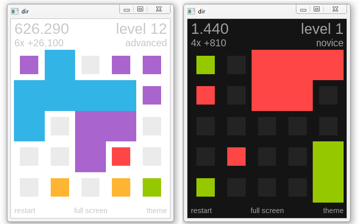

## About

dir is a small, elegant puzzle game written in Lua, using the excellent
[Love2D][] framework. I wrote it as a birthday gift for a friend.

It's also my attempt at designing a game that appeals to both casual and
hardcore audiences, without relying on quick reflexes or time limits.

Here are two screenshots:

And a feature list:

* Original mechanics that still feel familiar to match-3 game players.

* Highly replayable. Each game usually lasts between 5 and 15 minutes.

* Easy to play, hard to master gameplay, with finely tuned scoring
  and ranking systems. Can you get the grandmaster rank?

* All the graphics are vector-based and the game is resolution-independent.
  It looks great on a tiny handheld screen and on a 4k screen, without scaling
  or stretching pixels. It also adapts itself to almost any aspect ratio. Both
  windowed (resizable) and full screen modes are supported. Switching between
  both is instant.

* Three color themes.

## Installation

For Linux and Mac systems:

  * Install Love2D 0.9.2 using your package manager.

  * Download the latest `dir.love` release from the [Releases][] tab.

  * Run `love dir.love`.

On Windows:

  * Download the latest binaries from the [Releases][] tab. There are both
    x86 and x86-64 binaries available. Those include everything needed to play.

  * Extract and run `dir.exe`.

System requirements are very low. It should run without problems on any computer
with OpenGL support. Even the integrated graphics card on my laptop (Intel 965
Express) runs it at 90+ FPS (full screen), using 32 mb of ram and 5% CPU.

The game is portable. It does not read or write to files outside it's folder or
to the Windows registry. To uninstall, just delete the folder.

## How to play

As you can see from the screenshots above, the game takes place on a 5x5 grid
which contains tiles of different colors.

* Use the mouse to move a tile in any of the four cardinal directions. The
  mouse buttons move left or right while the mousewheel moves up or down.

* When the tile stops, any adyacent tile of the same color will count as a
  match. All the matching tiles will grow, the combo score increase and
  you can move again.

* The first move that doesn't match any tiles will cause all the previously
  matched tiles to disappear, grant the current combo score and add new tiles
  to the grid in random positions.

You lose when the grid is completely filled with tiles.

The game is infinite (in the same sense as Tetris is). The goal is to make
a score as high as possible and, eventually, to reach the grandmaster rank.

As with all puzzle games, the game may seem very hard at first. Don't worry,
you'll likely develop new strategies as you play.

## Keyboard shortcuts

Although dir is mouse-centric, there are some keyboard shortcuts available:

  Key      | Use
:--------: | :----------------------------------------------------------
   ESC     | Close the game.
    R      | Restart.
    F      | Toggle between full screen and windowed.
 1, 2, 3   | Change the color theme to the first, second and third one.
    T      | Cycle to the next color theme.

## Status

This program is finished!

dir is feature-complete and has no known bugs. Unless issues are reported
I plan no further development on it other than maintenance.

## License

Like all my hobby projects, this is Free Software. See the [Documentation][]
folder for more information. No warranty though.

[Documentation]: Documentation
[Releases]: https://github.com/Beluki/dir/releases

[Love2D]: https://love2d.org

